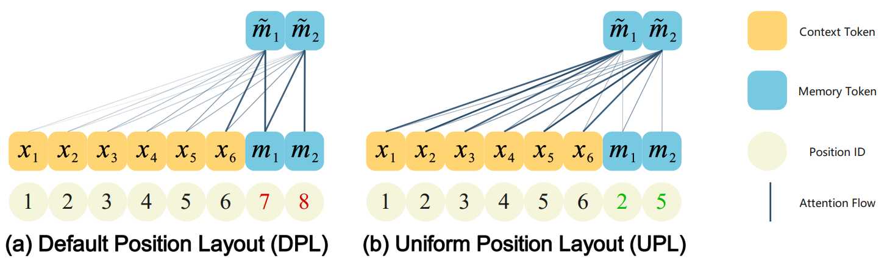

# EPL (Enhanced Position Layout)
Position IDs Matter: An Enhanced Position Layout for Efficient Context Compression in Large Language Models
This repository contains links to the experiments from our EMNLP Findings 2025 accepted paper ["In-context Autoencoder for Context Compression in a Large Language Model"](https://arxiv.org/abs/2409.14364).

